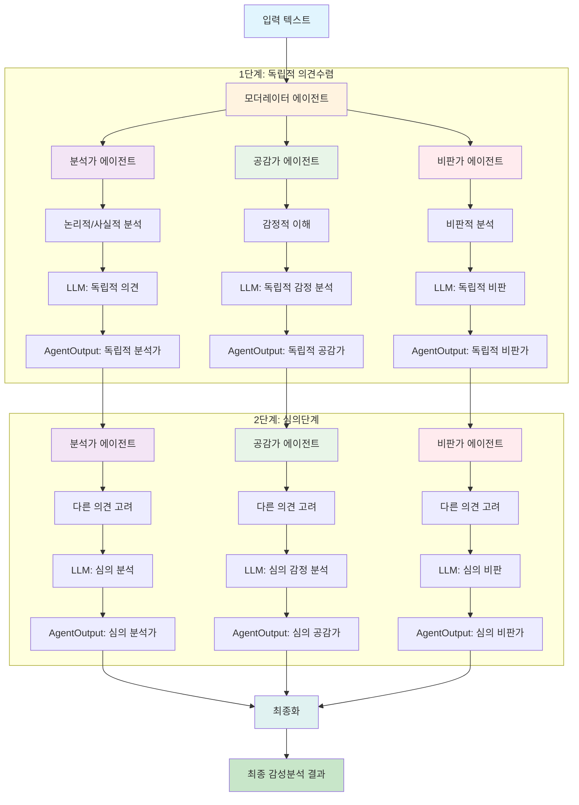
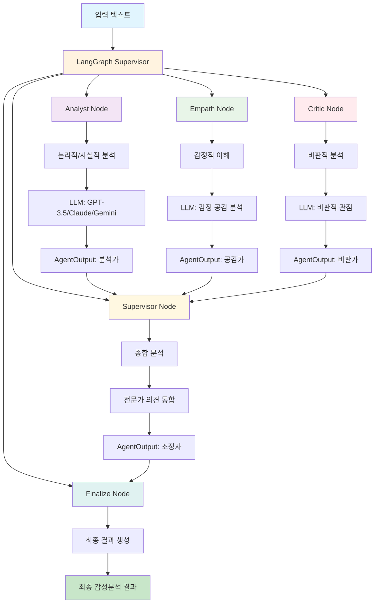
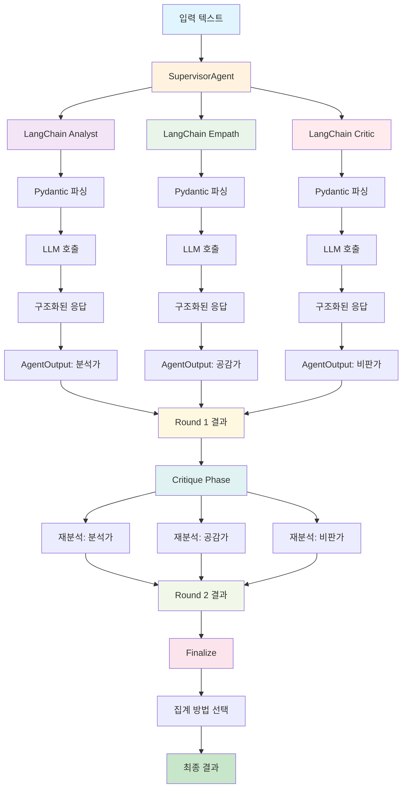
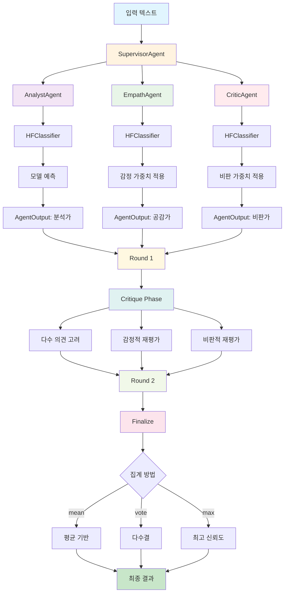
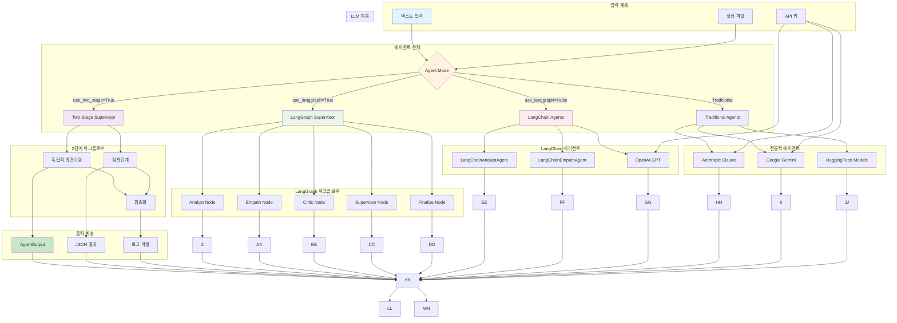
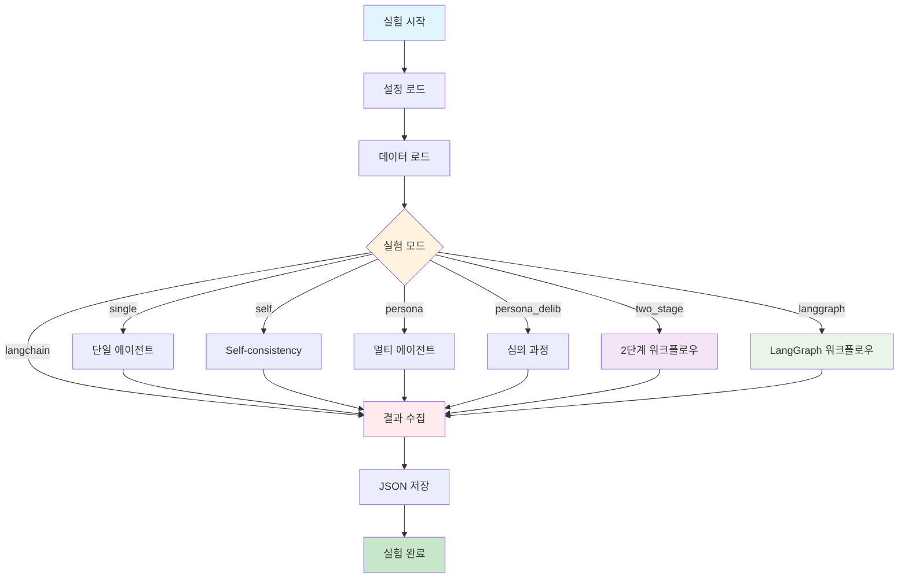

# KR Sentiment Agent Flow Diagram

## 1. 2단계 멀티 에이전트 시스템 (이미지 구조와 일치, 권장)

## 2. LangGraph 기반 워크플로우

## 3. LangChain 기반 개별 에이전트

## 4. 전통적 멀티 에이전트 시스템

## 5. 통합 아키텍처 개요

## 6. 실험 실행 플로우

## 주요 특징

### 2단계 워크플로우 (이미지 구조와 일치)
- **독립적 의견수렴**: 각 에이전트가 독립적으로 분석
- **심의단계**: 다른 에이전트들의 의견을 고려한 재분석
- **명확한 구분**: 2단계 프로세스로 구조화
- **이미지 일치**: 제공된 이미지와 동일한 구조

### LangGraph 워크플로우
- **노드 기반**: 각 에이전트가 독립적인 노드
- **자동화된 흐름**: 그래프 구조로 자동 실행
- **상태 관리**: 전체 프로세스 상태 추적
- **메시지 체인**: LangChain 메시지 시스템 활용

### LangChain 에이전트
- **구조화된 출력**: Pydantic 모델로 일관된 응답
- **프롬프트 템플릿**: 전문적인 프롬프트 엔지니어링
- **2단계 심의**: Round 1 + Critique Phase
- **다중 LLM**: OpenAI, Anthropic, Google 지원

### 전통적 에이전트
- **모델 기반**: HuggingFace 분류기 사용
- **가중치 적용**: 각 에이전트별 특화된 가중치
- **집계 방법**: mean, vote, max 선택 가능
- **하위 호환성**: 기존 시스템과 완전 호환
