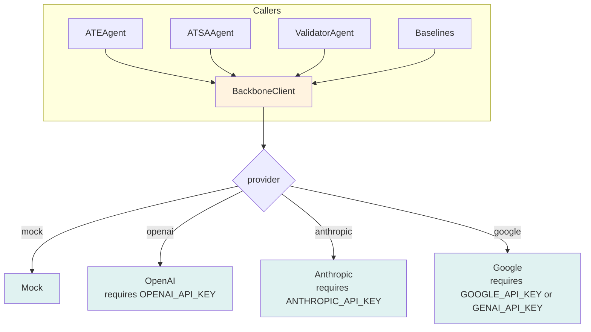

# KR Sentiment Agent Flow (Updated)

## 1. Proposed Pipeline (ATE → ATSA → Validator → Stage2 → Moderator)

```mermaid
graph TD
    A[Input text] --> B[BackboneClient]

    subgraph Stage1
        B --> C[ATEAgent Stage1\n(run_structured → AspectExtractionStage1Schema)]
        B --> D[ATSAAgent Stage1\n(run_structured → AspectSentimentStage1Schema)]
        B --> E[ValidatorAgent Stage1\n(run_structured → StructuralValidatorStage1Schema)]
    end

    subgraph Stage2 (always on)
        C --> F[ATEAgent Stage2\n(re-analysis with validator feedback)]
        D --> G[ATSAAgent Stage2\n(re-analysis with validator feedback)]
        E --> H[ValidatorAgent Stage2\n(final check)]
    end

    subgraph Moderator (rule-based)
        F --> I[Moderator\nRule A-D aggregation]
        G --> I
        H --> I
    end

    I --> J[FinalOutputSchema\nmeta/process_trace/analysis_flags/final_result]

    style A fill:#e1f5fe
    style J fill:#c8e6c9
    style B fill:#fff3e0
    style C fill:#f3e5f5
    style D fill:#e8f5e8
    style E fill:#ffebee
    style F fill:#f3e5f5
    style G fill:#e8f5e8
    style H fill:#ffebee
    style I fill:#e0f2f1
```

## 2. Mode Selection (CLI `--mode`)

```mermaid
graph TD
    A[CLI/config/env run_mode] --> B{mode}
    B -->|proposed| C[SupervisorAgent\n(ATE+ATSA+Validator+Stage2+Moderator)]
    B -->|bl1| D[BL1 Wrapper\nFree text -> BL2 parse -> FinalOutputSchema]
    B -->|bl2| E[BL2 Structured Prompt\nBL2OutputSchema -> FinalOutputSchema]
    B -->|bl3| F[Stage1 only\n(ATE/ATSA/Validator) + Moderator\nstage2_status=not_applicable]
    C --> G[outputs.jsonl (FinalOutputSchema)]
    D --> G
    E --> G
    F --> G
```

## 3. BackboneClient (single entry)



## 4. Prompts & Schemas
- Prompts: `agents/prompts/*.md` (ATE/ATSA/Validator stage1/2, moderator, bl2)
- Schemas: `schemas/agent_outputs.py`, `schemas/final_output.py`, `schemas/baselines.py`, `schemas/metric_trace.py`
- Runner: `tools/llm_runner.py` enforces JSON schema with repair; errors logged to `errors.jsonl`

## 5. Smoke & Checklist
- Smoke: `scripts/schema_validation_test.py --mode {proposed|bl1|bl2|bl3|all} --max-samples N`
- Checklist: `scripts/checklist_summary.py` (LLM single-entry, smoke outputs, errors log, contracts)

