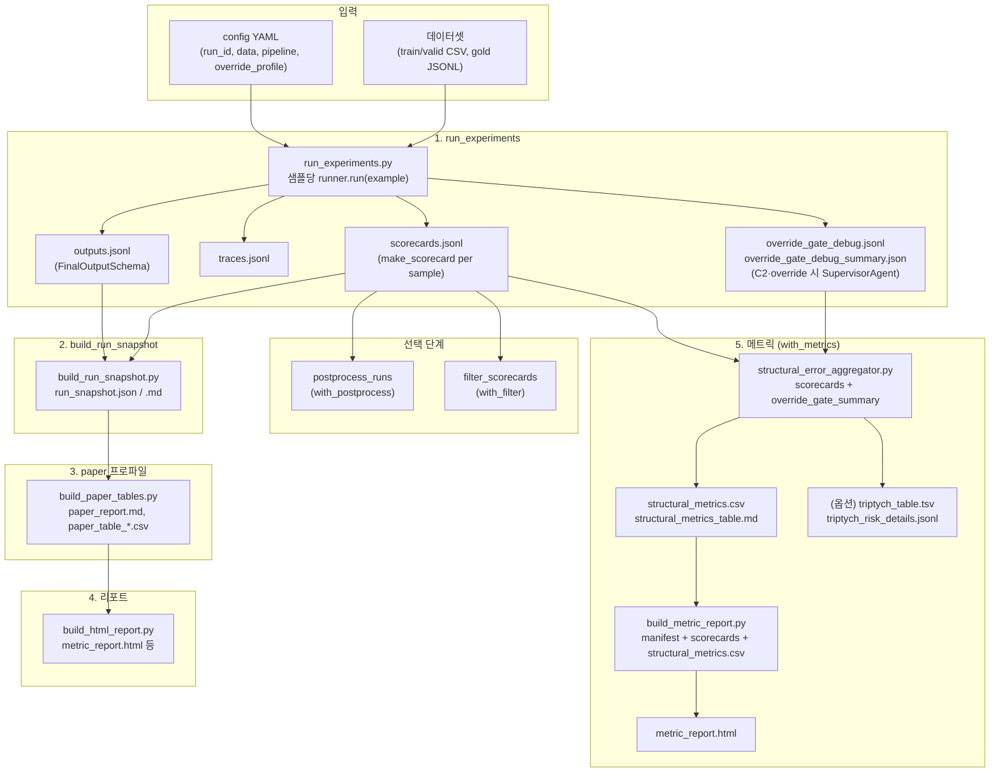
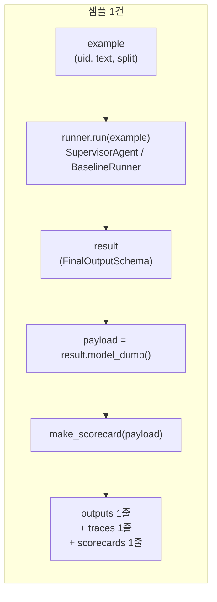
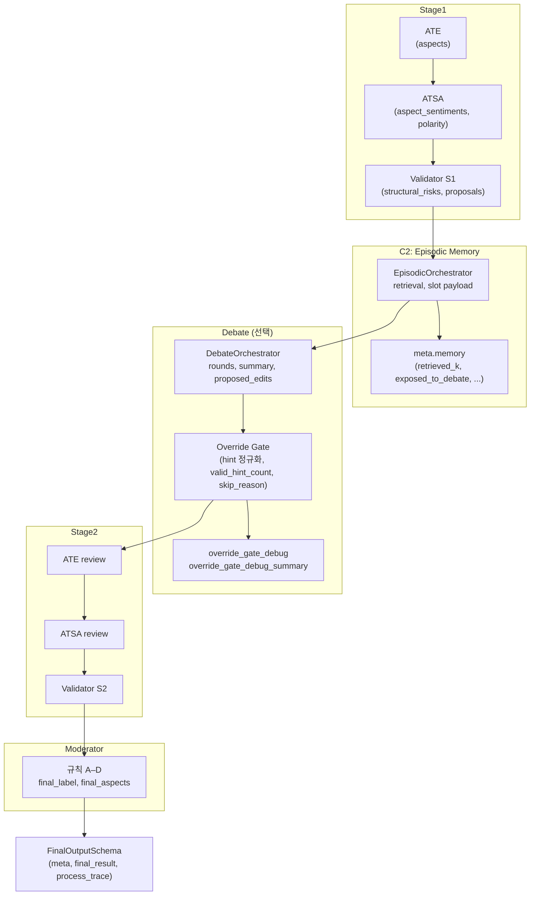

# 파이프라인 워크플로우 다이어그램

시스템 내 작업 처리 과정을 표현한 다이어그램과, 다이어그램 생성용 프롬프트를 정리합니다.

---

## 1. Mermaid 플로우차트 (run_pipeline + 데이터 흐름)



---

## 2. 샘플 단위 처리 흐름 (run_experiments 내부)



---

## 3. 에이전트 스테이지 (SupervisorAgent 내부)



---

## 4. 다이어그램 생성용 프롬프트

아래 프롬프트를 Mermaid/PlantUML/드로잉 도구나 LLM에 넣어 동일한 워크플로우 다이어그램을 재생성할 수 있습니다.

---

### 프롬프트 A: 전체 파이프라인 (시스템 작업 처리 과정)

```
다음 ABSA 실험 파이프라인 워크플로우를 흐름도로 그려줘.

[입력]
- config YAML: run_id, data(train/valid CSV, gold), pipeline 옵션, override_profile
- 데이터셋: train.csv, valid.csv, valid.gold.jsonl

[필수 단계]
1. run_experiments: config와 데이터로 샘플을 읽어, 샘플당 runner.run(example) 호출.
   - 출력: outputs.jsonl(샘플당 FinalOutputSchema 1줄), traces.jsonl, scorecards.jsonl(샘플당 make_scorecard 1줄).
   - C2·debate_override 사용 시 추가: override_gate_debug.jsonl, override_gate_debug_summary.json(SupervisorAgent가 기록).

2. build_run_snapshot: run_dir 기준으로 run_snapshot.json, run_snapshot.md 생성.

3. (paper 프로파일) build_paper_tables: paper_report.md, paper_table_*.csv 생성.

4. build_html_report: run_dir·리포트 디렉터리 기준으로 HTML 리포트 생성.

5. (with_metrics) structural_error_aggregator: scorecards.jsonl + override_gate_debug_summary.json을 읽어 structural_metrics.csv, structural_metrics_table.md 생성. 옵션으로 triptych_table, triptych_risk_details 내보내기 가능.

6. (with_metrics) build_metric_report: manifest + scorecards + structural_metrics.csv로 metric_report.html 생성.

[선택 단계]
- with_postprocess: postprocess_runs (scorecards 기반)
- with_filter: filter_scorecards

[데이터 흐름]
- outputs.jsonl → 1차 산출(에이전트 원시 출력·final_result).
- scorecards.jsonl → aggregator의 유일한 샘플 단위 입력; 메트릭 집계 후 structural_metrics.csv 1행.
- override_gate_debug_summary.json → aggregator가 override_hint_* 등 읽어 메트릭에 반영.
- structural_metrics.csv → build_metric_report가 HTML 테이블에 채움.

박스/노드로 단계와 산출물을 구분하고, 화살표로 입력→처리→출력 순서를 표시해줘.
```

---

### 프롬프트 B: 샘플 1건 처리 (run_experiments 내부)

```
한 샘플에 대한 실험 처리 흐름을 그려줘.

1. example(uid, text, split) 입력
2. runner.run(example) 호출 → SupervisorAgent 또는 BaselineRunner
3. result(FinalOutputSchema) 반환
4. payload = result.model_dump()
5. make_scorecard(payload) → scorecard 1건
6. outputs 1줄 + traces 1줄 + scorecards 1줄 기록

순서대로 박스와 화살표로 표현해줘.
```

---

### 프롬프트 C: 에이전트 스테이지 (SupervisorAgent 내부)

```
ABSA 에이전트 파이프라인 스테이지를 흐름도로 그려줘.

Stage1: ATE(aspects 추출) → ATSA(aspect_sentiments, polarity) → Validator S1(structural_risks, correction_proposals).

C2일 때: EpisodicOrchestrator가 retrieval·slot payload 수행 → meta.memory(retrieved_k, exposed_to_debate 등) 기록.

Debate(선택): DebateOrchestrator(rounds, summary, proposed_edits) → Override Gate(hint 정규화, valid_hint_count, skip_reason) → override_gate_debug·summary 기록.

Stage2: ATE review → ATSA review → Validator S2.

Moderator: 규칙 A–D로 final_label, final_aspects 합침 → FinalOutputSchema(meta, final_result, process_trace) 출력.

각 스테이지를 노드로, 데이터 흐름을 화살표로 표시해줘.
```

---

## 5. 참조

- **스테이지별 아웃풋·에이전트 처리·최종 메트릭 요약**: `docs/stage_outputs_and_metrics_summary.md` (표 형식 정리)
- **스테이지별 데이터·메트릭**: `docs/pipeline_stages_data_and_metrics_flow.md`
- **실행 스크립트**: `scripts/run_pipeline.py` (단계 순서·옵션)
- **실험 실행**: `experiments/scripts/run_experiments.py` (run_experiments, make_scorecard 호출)
